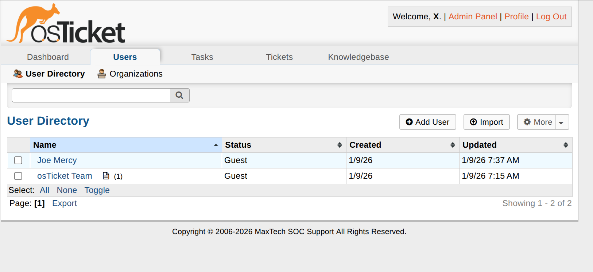
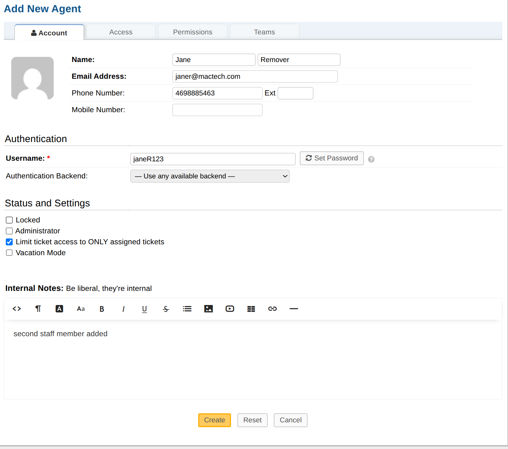
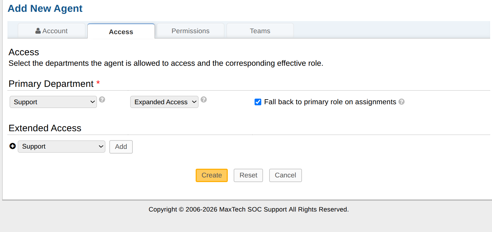
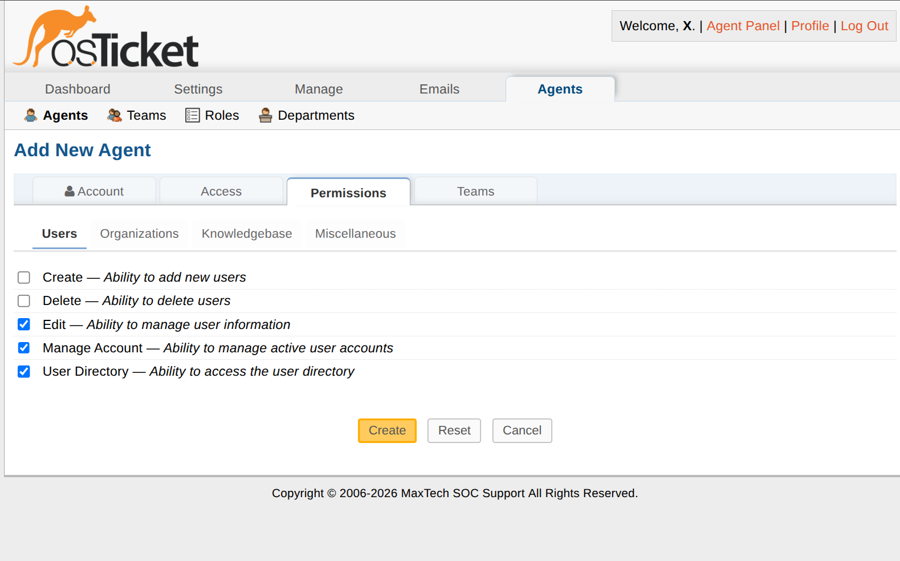

# osTicket Helpdesk on Azure

This project documents deploying a self-hosted IT ticketing system from scratch on a cloud VM. I provisioned an Ubuntu virtual machine on Microsoft Azure, manually built the LAMP stack, installed osTicket v1.18.1, and configured a working helpdesk with staff accounts and ticket management.

---

## Overview

The goal was to simulate a realistic IT support environment by standing up osTicket on a cloud-hosted server. This covers everything from Azure VM creation and server configuration to web app deployment and helpdesk setup. The project also ran into real-world issues like package conflicts and VM misconfiguration, which made it a useful hands-on exercise beyond just following a guide.

## Tools and Technologies

**Cloud**
- Microsoft Azure (Virtual Machine, Resource Groups)

**Operating System**
- Ubuntu (Azure Marketplace image)

**Web Stack**
- Apache 2.4
- PHP 8.2 (installed via Ondrej PPA)
- MariaDB

**Application**
- osTicket v1.18.1

**Other**
- Linux CLI / Bash
- apt package manager

## What I Did

1. **Created an Azure resource group and VM.** Ran into a problem here: I selected the wrong region for the resource group, which caused issues with dependent resources and required recreating it before moving forward.

2. **Connected to the VM and checked available resources.** Ran `df -h` and `free -m` to confirm disk space and memory before starting any installs. This turned out to be useful since space got tight later.

3. **Updated the system and fixed a broken package state.** After running `apt update` and `apt upgrade`, the package manager was in a broken state. Used `dpkg --configure -a` and `apt install -f` to resolve it before anything else would install cleanly.

4. **Installed Apache2.** Installed the web server and confirmed it was running with `systemctl status apache2`.

5. **Installed PHP 8.2 via the Ondrej PPA.** The default Ubuntu repositories do not carry PHP 8.2, so I added the Ondrej PHP PPA first, then installed PHP 8.2 along with all the extensions osTicket requires: `mysql`, `curl`, `imap`, `mbstring`, `gd`, `xml`, `bcmath`, `cli`, `fpm`, and `cgi`.

6. **Freed up disk space mid-install.** Ran `apt clean` and `apt autoremove` partway through to clear cached packages and reclaim space on the VM.

7. **Installed and secured MariaDB.** Started and enabled the MariaDB service, then ran `mysql_secure_installation` to remove anonymous users, disable remote root login, and set a root password. Logged in as root to create a dedicated database and user for osTicket.

8. **Downloaded and deployed osTicket.** Pulled osTicket v1.18.1 directly to `/var/www/html/`, unzipped it into a `helpdesk` subdirectory, and set file ownership to `www-data` so Apache could read the files.

9. **Ran the web-based installer.** Copied `ost-sampleconfig.php` to `ost-config.php`, temporarily set it to `0666` for the installer, then completed the setup through the browser.

10. **Locked down the installation post-setup.** Deleted the `/setup/` directory and reset `ost-config.php` to read-only (`0644`). osTicket requires both steps before it will operate normally.

11. **Created staff accounts and tested ticket creation.** Added staff members and submitted sample tickets to verify the full workflow was functional end to end.

## Findings and Results

- The helpdesk was accessible via the VM's public IP after setup.
- Staff accounts were created and visible in the agent view.
- Sample tickets appeared in the queue and showed the correct fields, confirming the database connection and osTicket configuration were working.
- MariaDB was hardened through the secure installation script and the osTicket database user had scoped credentials rather than using root.

## Challenges and How I Solved Them

**Wrong Azure region on resource group**
Selected the wrong region during initial VM setup. Resources that depend on a resource group need to be in a compatible region, so this required deleting the group and starting that portion over before continuing.

**PHP 8.2 not available in default repos**
Ubuntu's default package repositories do not carry PHP 8.2. The fix was adding the Ondrej PPA (`ppa:ondrej/php`), which provides maintained PHP versions on Ubuntu. A lot of older setup guides skip this step entirely.

**Broken package manager state**
Early on, the package manager hit a broken state, likely from an interrupted update. Had to run `dpkg --configure -a` and `apt install -f` to clear it before normal installs would proceed.

**Disk space getting tight**
The VM ran low on disk space during the PHP extension installs. Cleared the apt cache and removed unneeded packages with `apt clean` and `apt autoremove` to get enough space to finish.

## Screenshots

**VM Provisioning**

**Initial Connection**

**Database Setup**

**osTicket Configuration and Testing**

## What I Learned

1. Azure resource group region selection affects everything downstream. Catching that mistake early cost time but would have cost more time later.

2. PHP version management on Ubuntu is messier than expected. The default repos lag well behind current releases, and the Ondrej PPA is the standard fix. Most guides written before 2022 will not mention this.

3. Working with Linux installs taught me that constant trial and error is crucial for working towards outcomes you want. For an example, I thought there was an issue with my Microsoft Azure account, but it was an issue with the VM I created. I also found official documentation for recources more helpful than watching youtube videos or reading blogs for solving problems.
